# Othello game 
## components.py
### initialise_board subroutine
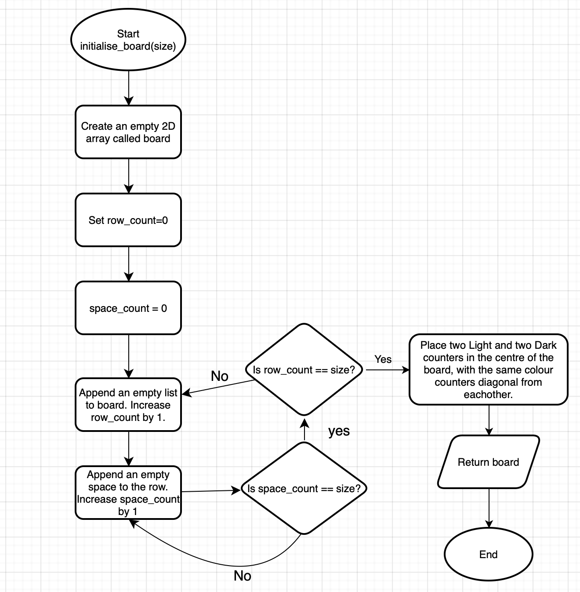

The above flowchart has been created for the initialise_board subroutine in the module components.py. It takes a parameter for the size of the board that will, at default, be 8. The subroutine creates a 2D array (row and column format) with the number of lists and empty spaces in each list, as specified by the size parameter, using a loop. It returns the board as a 2D array, when called. A 2D array has been used here as it represents data in a tabular format which is easy to read. This subroutine is called at the start of the main game loop to create an empty board with 4 counters in the centre. It is also used by the print_board subroutine to display the board to the user. This is implemented in code using a for loop to create empty lists with empty spaces in each. List assignment is also used to set the four counters in the centre to 'Light' and 'Dark ', and the rest to 'None '.

### print_board subroutine
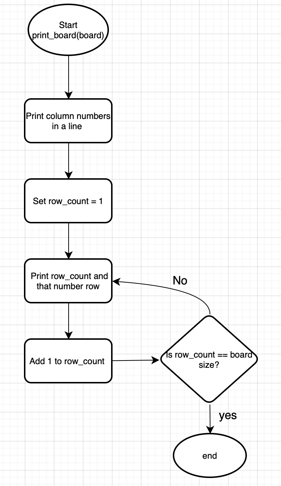

The above flowchart has been created for the print_board subroutine in components.py. It takes a board, represented with a 2D array, as a parameter. The subroutine begins by printing numbers 1 to the size of the board, for each column. The process then continues into a loop to print the row number and the actual row from the 2D array. The loop ends once all rows have been printed. 
### legal_move subroutine
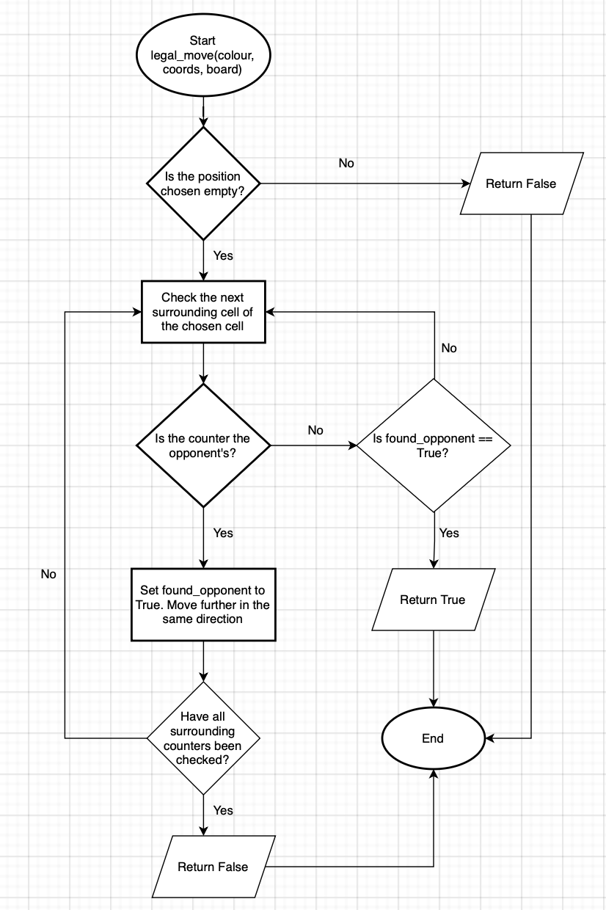

The above flowchart has been created for the legal_move subroutine in components.py. It takes the colour of the current players counter, the coordinates chosen and the board, as parameters. It returns True or False to signify whether a move is legal or not. The flowchart begins by checking if the chosen position is empty. If it is not empty it returns False. If it is empty, the process continues to check the surrounding counters of the chosen one. This is done in the code using a list of directions to surrounding counters and a for loop. Using a list of directions, instead of exact coordinates, allows us to see surrounding counters of all positions chosen. The surrounding counter is then checked to see if it is the opponents counter and if it is, it sets found_opponent to True and moves further in the same direction, in order to find an end that is their own counter. Once all surrounding counters have been checked, the process continues to the next surrounding counter. If the counter isn't the opponents and found_opponent is True, then the move is legal and True is returned. 

### flip_counters 
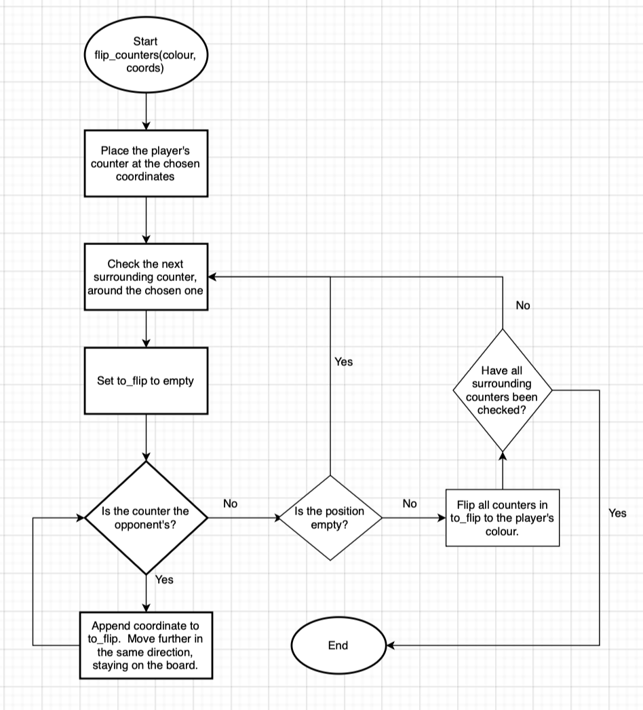

The above flowchart has been created for the flip counters subroutine in components.py. It takes the current players counter colour and their chosen coordinates, as parameters. It is used to allow the player to take their move and flip the opponents counters. The subroutine begins by placing the players counter at their chosen coordinates. It then traverses through each surrounding counter, checking if it is the opponents counter. If it is, it appends the coordinate to a list called to_flip and continues in that direction. This list is used later when actually flipping counters. If it is not the opponents counter it checks if it is the current players counter. If it is, it flips all the counters in to_flip and then continues to check surrounding counters. This is because, when a counter is placed, it can flip counters in multiple directions at the same time, if it is legal. Once all surrounding counters have been checked, the for loop terminates. 
## game_engine.py

### cli_coords_input
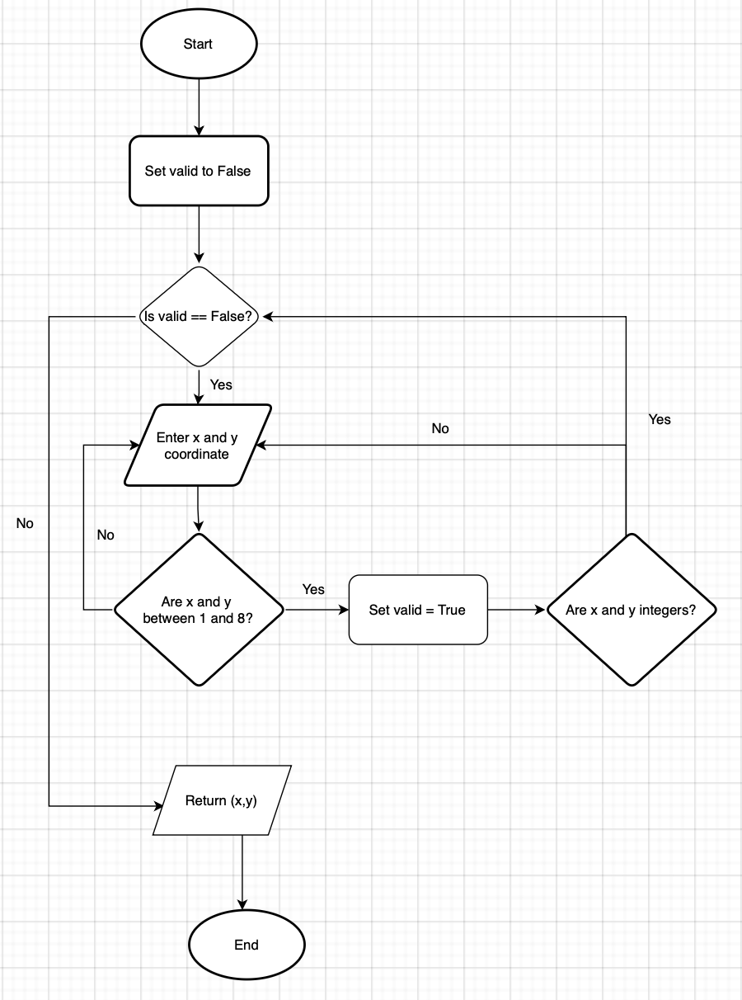

The above flowchart has been created for the coordinate input subroutine in game_engine.py. It takes no parameters and returns x and y coordinates as a tuple. It is used in the simple game loop subroutine to allow the user to enter their chosen coordinates, whilst validating them. The process begins by setting the variable valid to False. To start the while loop, as seen in the code, valid is checked. A while loop is used in order to continuously ask the user for coordinates until they have enterred valid ones. If it is still False, the user is prompted to enter their x and y coordinates. They are then validated to check if they are in the range and are integers. If they are valid, valid is set to True, the loop ends and x and y are returned. If the coordinates arent valid, the loop continues and the user is prompted to enter coordinates again. 

### check_moves_available 
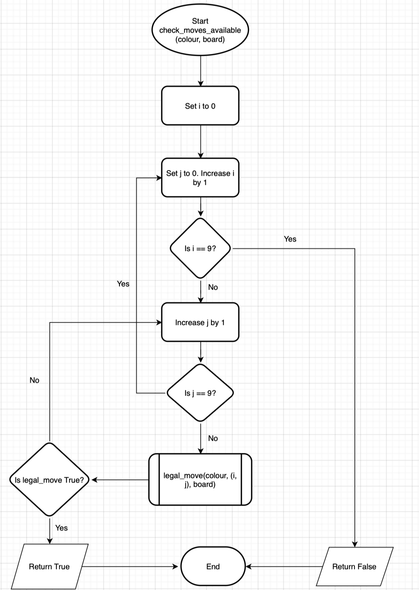

The flowchart above is used to show the subroutine that checks if a player has legal moves available. It is used before every move, to check there are legal moves left, in order for the game to continue. It takes the current players counter colour and the board as parameters. It returns a boolean value. The process begins with a for loop where i and j are set to 0. The value of i is increased by 1 and it is checked to see if it equals 9 (by default) or the board size plus one. If i equals 9, all coordinates have been checked so False is returned. Otherwise, j is increased by 1 and checked if it equals 9. If it doesn't, the legal move subroutine is called with i and j as its coordinates. A nested subroutine is used here to increase code readability and organisation. If the subroutine returns True, this subroutine also returns True as at least one legal move has been found. Otherwise, the process continues to the next coordinate. 

### simple_game_loop
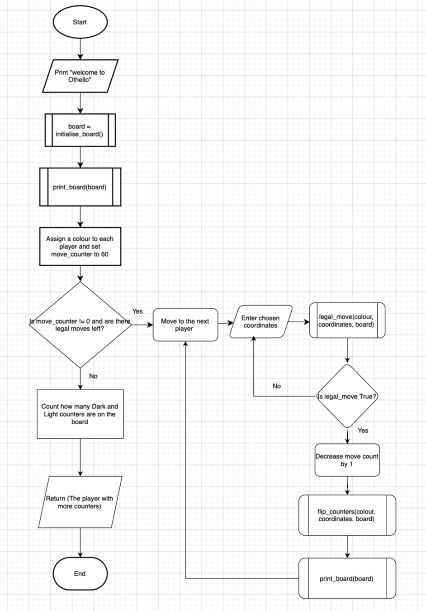

The above flowchart is used to show the overall game loop that occurs, when the game is run. It begins with a welcome message and the initial board. It then initialises player details by setting move counter to 60 and assigning each player a colour. A while loop is then used to check if each player has legal moves left. This allows the game to continue there are no more possible moves. If there are legal moves left, the game continues and a player enters coordinates. These are checked using the legal_move subroutine before counters are flipped and the board is printed. The process continues moving to the next player and decreasing the move counter by 1. Once each player has no legal moves left, their counters are counted and the winner is output. Nested subroutines are used again in order to combine the functionalities of each individual subroutine and increase code organisation and readability.

## Flask 
### move
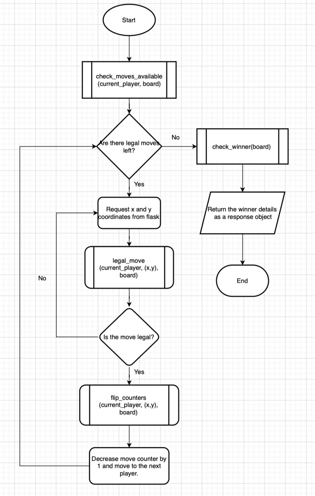

The above flowchart shows how a move is carried out using Flask. It begins by checking that there are legal moves available, using the check_move_available subroutine from game_engine.py. If there are legal move left, a request is sent to retrieve the x and y coordinates that are input when a user clicks on a tile on the webpage. These coordinates are then checked to see if their legal. If the are, the counters are flipped, move counter decreases by 1 and the game log is updated to show the next player. Otherwise, the player is prompted to click on anothe tile. If there are no legal moves left it means that the game has ended, so the winner is checked and returned using the check_winner subroutine. 

### ai_move
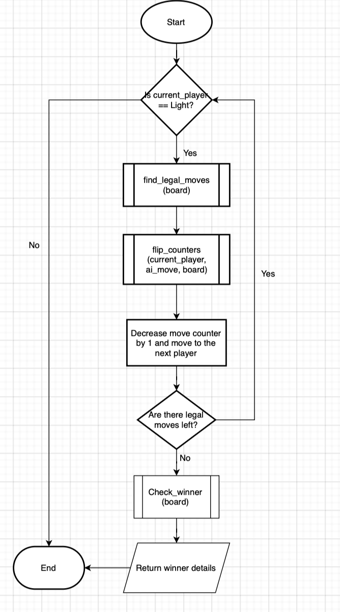

The above flowchart is used to show how the AI opponent finds the best move and carries it out. The process begins by checking if it is the AI's go. The find_legal_moves subroutine in the ai_py file, is then called to find the best legal move that flips the most counters. The counters are then flipped, move_counter decreases by 1 and the game log updates for the next player. The subroutine then checks if there are legal moves left. If there aren't the check_winner subroutine is called and winner details are returned.

### next_player
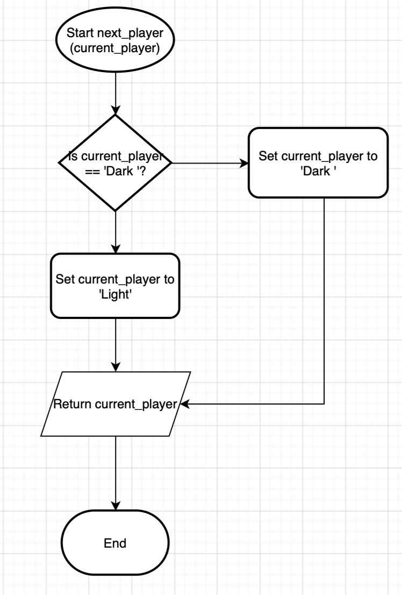

The above subroutine is used to switch between each player. It begins by checking the counter colour of the current player using an if statement. If it is dark, the subroutine sets it to light and if it is light it sets it to dark. It then returns current_player to be used in game play.

### check_winner
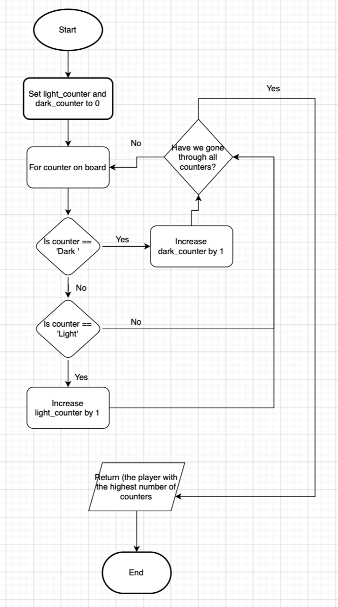
The above flowchart is used to check the winner, once there are no legal moves left. A for loop is used to count how many of each counter there are. Once all counters have been counted, the winner is returned. 

### save_game 
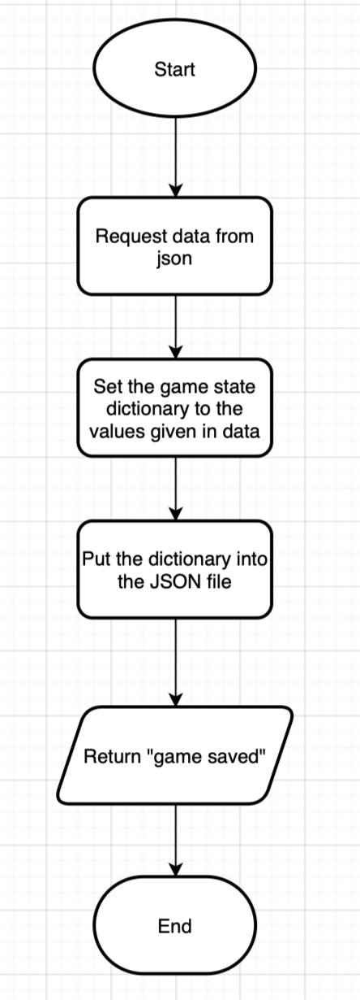

The above flowchart is used when the save game button is pressed on the web page. It allows the user to save the current game state by requesting the data from flask and putting it in a .json file to be loaded and used later.

### load_game
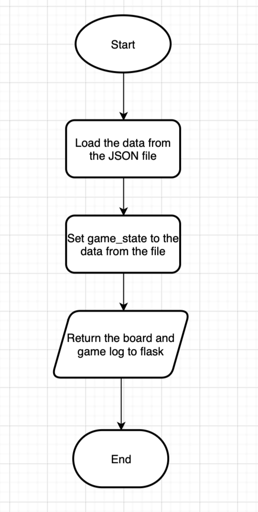

The above flowchart is used when the load game button is pressed on the web page. It allows the user to load the previously saved game state by requesting the data from the .json file.

## AI opponent
### find_legal_moves 
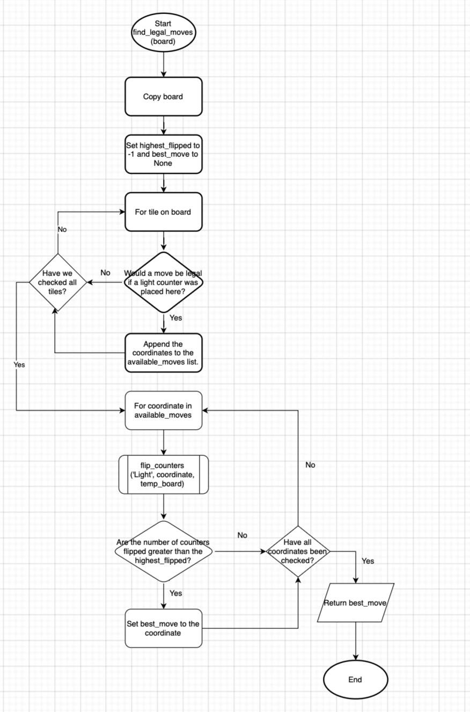

The above flowchart is used to show how AI optimises the benefit gained from the move taken. It begins by copying the current board so testing can be carried out on a temporary board, without affecting the main board. The process then continues to check each tile on the board and check whether a move would be legal if a counter was placed there. If it would be, the coordinate is added to the available_moves list. This continues until all tiles have been checked. Once all tiles have been checked, the process traverses through the available moves list and calls the flip_counters subroutine to check how many counters are flipped if a counter was placed here. The function then returns the move that flips the most counters. 

